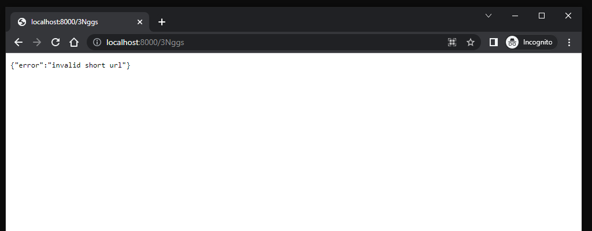

# Background

Creating a toy URL shortening service has been on my mind for months, and since I've been learning about FastAPI this week, I had the perfect opportunity to finally turn this dream into a reality.

# Key Features
- Create shortlinks via API or via command line `curl`
- Maintains an access count of how many times the short URL has been accessed
- Stores when the short URL was generated
- Provides security by requiring a 16-character admin key to be included to see stats
- Allows deletion of a shortlink (if requester provides the associated admin key)
- Uses a super simple SQLite database

# Ideas for Improvement
- Add [testing](https://fastapi.tiangolo.com/tutorial/testing/) via `pytest`
- Add functionality to update the full URL associated with a short url (e.g., `PUT /{short_url}/{admin_key}?full_url={full_url}`)
- Use a central data store and multiple shortlink servers (e.g., an autoscaling group)
- Set up multiple read replicas of the data store to speed up redirections
- Refactor the updating of `access_count` for each shortlink via messaging or a queue instead of immediate DB access
- Store the HTTP referrers as an additional stat for each shortlink


# Installation and Usage

1. Clone the repo. Here's a pretty typical way on most platforms.

```bash
mkdir fastapi-demo-url-shortener
gh auth login
gh repo clone timoteostewart/fastapi-demo-url-shortener ./fastapi-demo-url-shortener

```

2. Create a virtual environment.

```bash
cd fastapi-demo-url-shortener
python -m venv .venv
. ./.venv/bin/activate # (or & ./.venv/Scripts/Activate.ps1 on Windows)
```

3. Install Python requirements.

`requirements.txt` is up to date in the repo, but here is the `pip install` method too:

```bash
pip install wheel fastapi[all]
```

4. Start the test server.

```bash
uvicorn main:app --reload --host 0.0.0.0 --port 8000
```

5. When the test server is up and running, you can read the nicely <a href="http://localhost:8000/docs">autogenerated API docs</a>.

6. To create a shortlink, use `curl` to send a `POST` request. You'll get back some JSON with the `short_url` and some other info.

```bash
C:\> curl -X POST localhost:8000?full_url=https://www.nytimes.com

{"full_url":"https://www.nytimes.com","short_url":"WAGLf","admin_key":"WafR7whH7ORFN2Vp","when_created_unix":1675316357,"access_count":0}
```

7. You can use the shortlink using `curl` or a local Web browser.

```bash
curl -X GET localhost:8000/WAGLf
```

8. Statistics about the shortlink are available via a `GET` method, so you can use either `curl` or a Web browser. (Notice that the `access_count` has gone up; I accessed the shortlink a bunch of times in a browser to spice things up!)

```bash
C:\> curl -X GET localhost:8000/WAGLf/WafR7whH7ORFN2Vp

{"full_url":"https://www.nytimes.com","short_url":"WAGLf","admin_key":"WafR7whH7ORFN2Vp","when_created_unix":1675316357,"access_count":6}
```


# Screenshots

## Using `curl` on Windows PowerShell to create a shortlink to nytimes.com


## Getting an "invalid short URL" error because I mistyped the last character of the short URL



## Successful redirection once I type the short URL correctly


# License

This repo is MIT licensed, as found in the LICENSE file.

